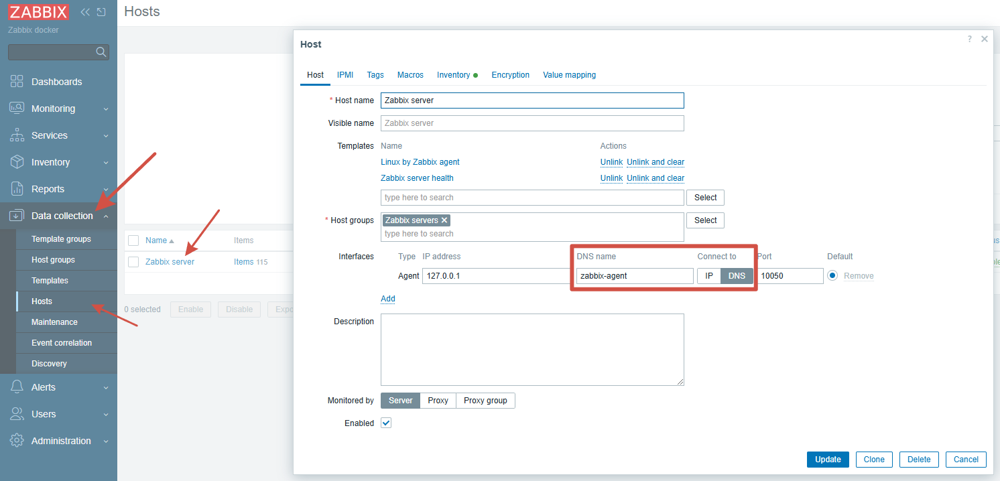
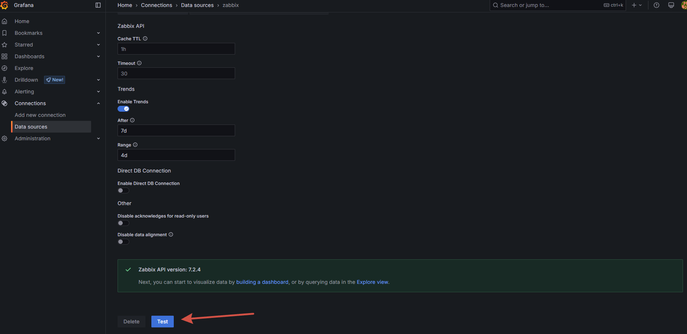

# docker compose - Zabbix NGINX PostgreSQL + Grafana

- [Official Zabbix Dockerfiles](https://github.com/zabbix/zabbix-docker)
- [Zabbix plugin for Grafana dashboard](https://github.com/grafana/grafana-zabbix)


For those who are used to using zabbix to collect metrics, but want to start drawing dashboards more beautifully

Example simple docker-compose service

- **Postgresql:**                16.2
- **Zabbix Server:**             7.0.3
- **Zabbix Frontend NGINX:**     7.0.3
- **Zabbix Agent:**              7.0.3
- **Grafana:**                   11.2.0

## Guide

### Clone repo:
```
git clone https://github.com/akmalovaa/zabbix-docker.git
cd zabbix-docker
```

### Check or change settings in the `.env` file

### Run docker-compose:
```
docker-compose up -d
```

The first launch takes 1-2 minutes

### Zabbix `localhost:8080`
default user password 
- **login:** Admin
- **password:** zabbix


**Zabbix server** - Host / change use connect from DNS `zabbix-agent`


### Grafana `localhost:3000` 

default user password (change `grafana/grafana.ini` auth.anonymous enabled)
- **login:** admin
- **password:** 12345

Test data source

`Grafana -> Connections -> Data sources -> zabbix -> Test`


### Debug
```
docker-compose logs --tail=1 -f
```
