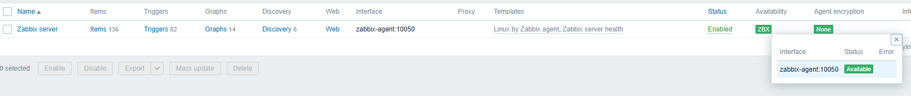

# Zabbix NGINX PostgreSQL + Grafana

> Simplified Docker Compose configuration for running Zabbix monitoring system with Grafana dashboards

- [Official Zabbix Dockerfiles](https://github.com/zabbix/zabbix-docker)
- [Zabbix plugin for Grafana dashboard](https://github.com/grafana/grafana-zabbix)


For those who are used to using zabbix to collect metrics, but want to start drawing dashboards more beautifully

Example simple docker-compose service

Current versions:

- **Zabbix Server:** 7.4
- **PostgreSQL:** 17-alpine
- **Grafana:** 12.1.0

## Quick Start

### 1. Clone Repository

```shell
git clone https://github.com/akmalovaa/zabbix-docker.git
cd zabbix-docker
```

### 2. Configure Environment (Optional)

Review and modify the `.env` file if needed:

```shell
cp .env .env.local  # Optional: create local copy
nano .env           # Edit configuration
```

### 3. Start Services

```shell
docker compose up -d
```

⏱️ **First launch takes 1-2 minutes** while PostgreSQL initializes and Zabbix server starts.

### 4. Verify Installation

Check if all services are running:

```shell
docker compose ps
```

## Configuration

### Environment Variables

Key variables in `.env` file:

| Variable | Default | Description |
|----------|---------|-------------|
| `POSTGRES_USER` | `zabbix` | PostgreSQL username |
| `POSTGRES_PASSWORD` | `zabbix` | PostgreSQL password |
| `POSTGRES_DB` | `zabbix` | Database name |
| `GF_SECURITY_ADMIN_USER` | `admin` | Grafana admin username |
| `GF_SECURITY_ADMIN_PASSWORD` | `12345` | Grafana admin password |
| `TZ` | `Asia/Yekaterinburg` | Timezone for all services |

> ⚠️ **Security Note**: Change default passwords in production!

## Services & Ports

| Service | Internal Port | External Port | URL |
|---------|---------------|---------------|-----|
| Zabbix Frontend | 8080 | 8080 | [YOUR_HOST:8080](http://localhost:8080) |
| Grafana | 3000 | 3000 | [YOUR_HOST:3000](http://localhost:3000) |
| Zabbix Agent | 10050 | 10050 | (used internally) |
| Zabbix Server | 10051 | 10051 | (used internally) |
| PostgreSQL | 5432 | - | Default Internal only |

## Usage

### Zabbix Web Interface

**URL:** [localhost:8080](http://localhost:8080)

**Default Credentials:**

- **Username:** `Admin`
- **Password:** `zabbix`

#### Configure Zabbix Agent Connection

1. Navigate to **Configuration** → **Hosts**
2. Click on **Zabbix server** host
3. Go to **Interfaces** tab
4. Change **Connect to** from IP to **DNS**
5. Set **DNS name** to `zabbix-agent`
6. **Update** the host




### Grafana Dashboard

**URL:** [localhost:3000](http://localhost:3000)

**Default Credentials:**

- **Username:** `admin`  
- **Password:** `12345`

> 💡 Anonymous access is enabled by default (see `grafana/grafana.ini`)

#### Test Zabbix Data Source

1. Go to **Connections** → **Data sources**
2. Select **Zabbix** data source
3. Click **Test** button
4. Should show "Data source is working"


## Troubleshooting

### Check Service Logs

```shell
# All services
docker compose logs --tail=10 -f

# Specific service
docker compose logs -f zabbix-server
docker compose logs -f postgres
```

### Common Issues

#### 1. Zabbix Server Won't Start

```shell
# Check database connection
docker compose logs zabbix-server

# Restart services in order
docker compose restart postgres
sleep 30
docker compose restart zabbix-server
```

#### 2. Can't Access Web Interface

```shell
# Check if ports are available
netstat -tulpn | grep -E ':(8080|3000|10051|10050)'

# Check container status
docker compose ps
```

#### 3. Grafana Data Source Connection Failed

```shell
# Verify Zabbix API is accessible
curl -X POST http://localhost:8080/api_jsonrpc.php \
  -H "Content-Type: application/json" \
  -d '{"jsonrpc":"2.0","method":"apiinfo.version","id":1}'
```

### Performance Tuning

For better performance with large datasets:

```yaml
# Add to zabbix-server environment in compose.yaml
ZBX_CACHESIZE: "128M"
ZBX_CACHEUPDATEFREQUENCY: "60"
ZBX_STARTDBSYNCERS: "4"
```

## Security Considerations

### Production Deployment Checklist

- [ ] Change default passwords in `.env`
- [ ] Use strong database passwords
- [ ] Restrict access to ports (use firewall/security groups)
- [ ] Enable HTTPS for Zabbix frontend
- [ ] Configure proper backup strategy

## References

- [Official Zabbix Docker Images](https://github.com/zabbix/zabbix-docker)
- [Zabbix Plugin for Grafana](https://github.com/grafana/grafana-zabbix)
- [Zabbix Documentation](https://www.zabbix.com/documentation/current/)
- [Grafana Documentation](https://grafana.com/docs/)
